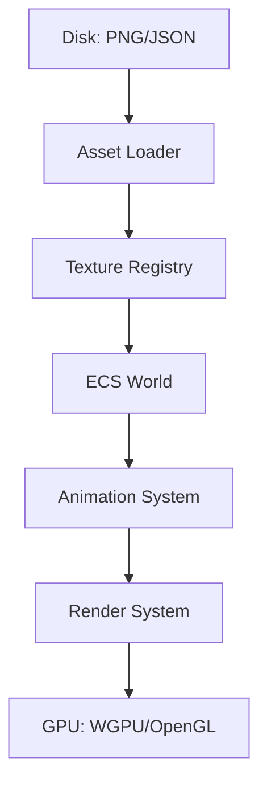

To make your engine's architecture official, you can add this `ARCHITECTURE.md` file to your project root. It outlines the data flow, the 60 FPS timing logic, and the ECS structure specifically for your Rust implementation.

---

# Game Engine Architecture: Sprite Animation & ECS

This document defines the technical structure for the engine's asset loading, animation timing, and Entity Component System (ECS) integration.

## 1. High-Level Data Flow
The engine follows a **Data-Oriented Design (DOD)**. Assets are loaded once into a central Registry, and Entities reference them via IDs to minimize memory overhead.




---

## 2. ECS Component Definitions
Components are Plain Old Data (POD) structs stored in contiguous memory for cache efficiency.

### `Transform`
Stores the spatial state of an entity.
* `position: Vec2<f32>`
* `rotation: f32`

### `Sprite`
The visual representation of an entity.
* `texture_handle: AssetId` (Pointer to the loaded GPU texture)
* `uv_rect: [f32; 4]` (The current [x, y, w, h] coordinates on the sprite sheet)

### `Animation`
State machine for frame-based playback.
* `frames: Vec<[f32; 4]>` (Pre-calculated UV coordinates)
* `fps: f32` (Target playback speed, e.g., 12.0)
* `timer: f32` (Accumulated delta time)
* `is_looping: bool`

---

## 3. The 60 FPS Timing Model
To ensure consistent 60 FPS playback regardless of hardware speed, the engine utilizes a **Variable Delta Time** approach.


### Frame Timing Math
The system calculates the duration since the last iteration ($\Delta t$):
$$\Delta t = T_{current} - T_{last}$$

The `AnimationSystem` updates the `Animation` component state using:
1. **Accumulate:** `anim.timer += delta_time`
2. **Threshold:** `if anim.timer >= (1.0 / anim.fps)`
3. **Step:** Increment `current_frame` and subtract duration from `timer`.

---

## 4. Systems Logic
Systems are decoupled logic blocks that iterate over Component queries.

### `AnimationSystem` (Update Phase)
* **Query:** `(mut Animation, mut Sprite)`
* **Responsibility:** Advances frames based on $\Delta t$. It does **not** touch the GPU; it only updates the `uv_rect` data in the `Sprite` component.

### `RenderSystem` (Draw Phase)
* **Query:** `(Sprite, Transform)`
* **Responsibility:** Batches all visible sprites and submits them to the GPU. It uses the `uv_rect` to tell the fragment shader which part of the texture to draw.

---

## 5. Asset Manifest Format (JSON)
The engine expects a sidecar JSON file for every animated sprite sheet to define frame boundaries.

```json
{
  "texture": "player_run.png",
  "frame_size": [32, 32],
  "animations": {
    "run": {
      "start_frame": 0,
      "end_frame": 7,
      "fps": 10.0
    }
  }
}
```

---

## 6. Optimization Checklist
- [ ] **Zero Allocations:** No `Vec` or `String` creation inside the `AnimationSystem` loop.
- [ ] **Texture Atlasing:** Combine multiple animations into a single GPU texture to reduce draw calls.
- [ ] **Pointer Stability:** Use indices (`u32`) instead of Rust references for components to satisfy the borrow checker.
